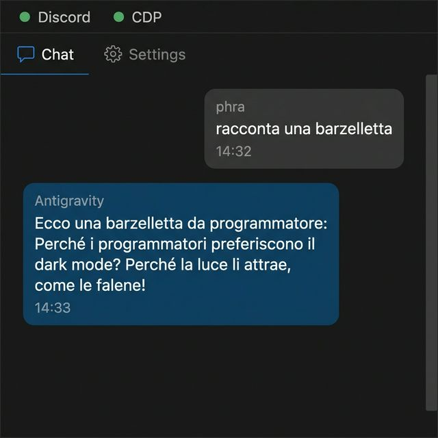
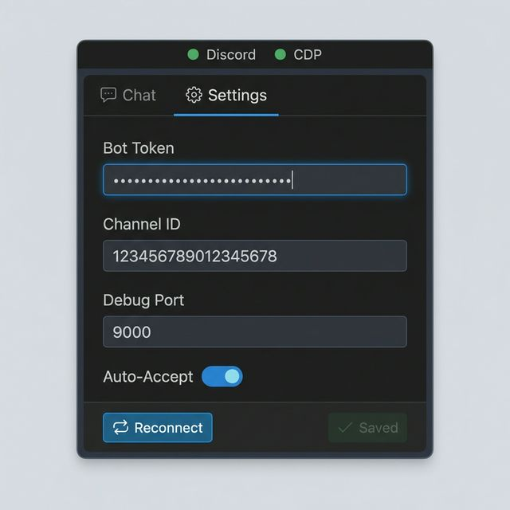

# Antigravity Discord Bridge

> **Bridge your VS Code AI chat with a Discord channel.** Messages from Discord are auto-processed by the Language Model in your IDE, and responses are sent back — all in real-time.

## Features

- 🤖 **Auto-processing** — Discord messages are automatically sent to the IDE Language Model (Gemini, Copilot, etc.) and responses are posted back
- 💬 **Multi-conversation** — Each Discord message creates a thread; replies in threads continue the same Antigravity conversation
- 🔧 **CDP Bridge** — Uses Chrome DevTools Protocol to interact with the Antigravity chat editor, preferring the Manager window for stability
- ✅ **Auto-Accept** — Automatically clicks Accept / Run / Always Allow buttons, always-on when CDP is connected
- 📋 **Message Queue** — Concurrent Discord messages are queued (up to 5) instead of rejected, with position feedback
- 🔒 **Single-instance** — Leader election via VS Code `globalState` ensures only one extension host connects to Discord, even with multiple windows open
- 🎨 **Rich Markdown** — Code blocks, bold, italic, inline code, lists, and blockquotes are preserved on Discord
- ⚙️ **Settings GUI** — Tabbed sidebar panel with built-in settings form (Bot Token, Channel ID, Debug Port, Auto-Accept toggle)
- 📡 **Live Status** — Green/red connection indicators for Discord, CDP, and Auto-Accept right in the sidebar
- ✂️ **Smart message splitting** — Automatically splits long responses to respect Discord's 2000-character limit
- 🔇 **Noise filtering** — Strips Antigravity UI chrome and diagnostic logs from responses automatically
- 💭 **Thinking spoilers** — AI reasoning/thinking content is sent as Discord spoiler text
- 🎨 **VS Code theming** — Chat and settings panels follow your IDE theme

## Screenshots

| Chat Panel | Settings Panel |
|:-:|:-:|
|  |  |

## Installation

### From VS Code Marketplace

Search for **"Antigravity Discord Bridge"** in the Extensions panel (`Ctrl+Shift+X`) and click **Install**.

### From .vsix (Releases)

1. Download the latest `.vsix` from [Releases](https://github.com/phra/Antigravity-Discord-Bridge/releases)
2. In VS Code: `Ctrl+Shift+P` → **Extensions: Install from VSIX...** → select the file

### From source

```bash
git clone https://github.com/phra/Antigravity-Discord-Bridge.git
cd Antigravity-Discord-Bridge
npm install
npm run compile
npm run package
```

Then install the generated `.vsix` file as described above.

## Quick Start

### 1. Create a Discord Bot

1. Go to [Discord Developer Portal](https://discord.com/developers/applications)
2. Click **New Application** → give it a name → **Create**
3. Go to **Bot** tab → click **Reset Token** → copy the token
4. Enable **Message Content Intent** under Privileged Gateway Intents
5. Go to **OAuth2** → **URL Generator**:
   - Select scopes: `bot`
   - Select permissions: `Send Messages`, `Read Message History`, `Create Public Threads`, `Send Messages in Threads`
   - Copy the generated URL and open it to invite the bot to your server
6. Right-click the target channel in Discord → **Copy Channel ID** (enable Developer Mode in Discord settings if needed)

### 2. Start Antigravity with Debugging

Launch Antigravity with the remote debugging port enabled:

```bash
antigravity --remote-debugging-port=9000
```

### 3. Configure the Extension

Open the **Discord** sidebar panel (click the Discord icon in the activity bar) and switch to the **⚙️ Settings** tab:

| Setting | Description | Default |
|---------|-------------|---------|
| **Bot Token** | Your Discord bot token | — |
| **Channel ID** | Target Discord channel ID | — |
| **Debug Port** | Antigravity `--remote-debugging-port` value | `9000` |
| **Auto-Accept** | Auto-click Accept/Run/Always Allow buttons | `true` |

Alternatively configure via VS Code Settings (`Ctrl+,`) → search `antigravity-discord`.

The bot connects automatically. You should see **"Antigravity Discord Bridge: Connected!"** and green status dots for Discord and CDP.

### 4. Use It

**From Discord:**
- Type in the configured channel → a thread is created with the AI response
- Reply in the thread → continues the same Antigravity conversation
- Start a new message in the main channel → creates a new conversation

**Sidebar panel:**
Click the Discord icon in the activity bar to see the conversation and manage settings.

## How It Works

```
Discord User → message → Discord Channel
                              ↓
                    BridgeController (leader election via globalState)
                              ↓
                    DiscordClient (single routeMessage gate)
                              ├─ Main channel msg → new Antigravity conversation + new thread
                              └─ Thread reply → switch to existing conversation
                              ↓
                    CdpBridge (Chrome DevTools Protocol → Manager window)
                              ↓
                    Antigravity Chat Editor (DOM injection)
                              ↓
                    AI Agent processes message
                              ↓
                    CDP extracts response (snapshot diffing + markdown extraction)
                              ↓
                    Response → Discord Thread + Sidebar Panel
```

### Architecture

- **`BridgeController`** — Orchestrates the message lifecycle. Uses a state machine (`idle` → `processing` → `idle`) and a message queue. Only the elected leader instance connects to Discord.
- **`DiscordClient`** — Wraps discord.js. A single `routeMessage()` gate with 5 rules handles all incoming messages. No duplicate-processing layers.
- **`CdpBridge`** — Connects to Antigravity via CDP, preferring the Manager window (flat DOM, stable layout). Handles message injection, response extraction, conversation management, and auto-accept.

**Leader Election:** Antigravity can open multiple windows (IDE, Manager, Launchpad), each with its own extension host. The extension uses VS Code `globalState` with a heartbeat to elect a single leader — other instances skip Discord/CDP connection entirely.

**Auto-Accept** runs a CDP-injected interval that finds and clicks confirmation buttons (Accept, Run, Always Allow), scrolling them into view if needed. It activates automatically when the CDP connection is established.

## Settings

| Setting | Type | Default | Description |
|---------|------|---------|-------------|
| `antigravity-discord.botToken` | `string` | `""` | Discord Bot Token |
| `antigravity-discord.channelId` | `string` | `""` | Discord Channel ID to bridge |
| `antigravity-discord.debugPort` | `number` | `9000` | Antigravity remote debugging port |
| `antigravity-discord.autoAccept` | `boolean` | `true` | Auto-click Accept/Run/Always Allow during processing |

## Development

```bash
# Install dependencies
npm install

# Compile
npm run compile

# Watch mode
npm run watch

# Run tests
npm test

# Package as .vsix
npm run package
```

### Testing locally

1. Open this project in VS Code
2. Press `F5` to launch Extension Development Host
3. Start Antigravity with `--remote-debugging-port=9000`
4. Configure bot token and channel ID in the dev instance
5. Send a message in Discord → see it processed

## Requirements

- VS Code 1.93.0+
- Antigravity started with `--remote-debugging-port=9000`
- A Discord bot token ([create one here](https://discord.com/developers/applications))

## License

[MIT](LICENSE)
